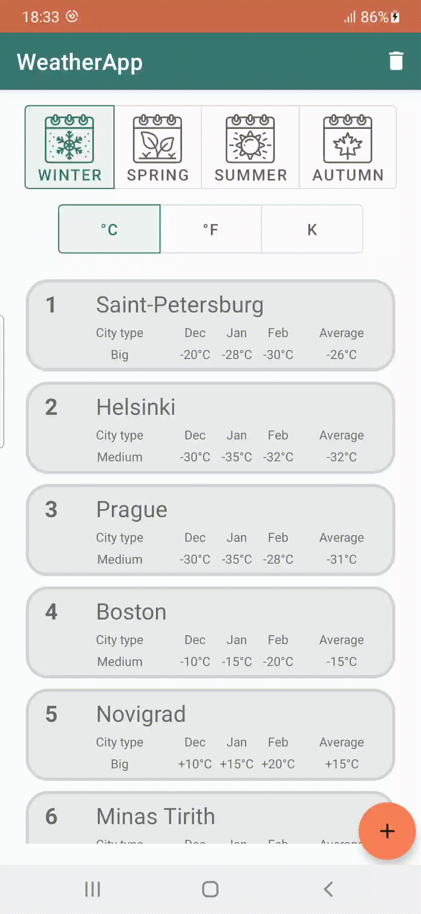
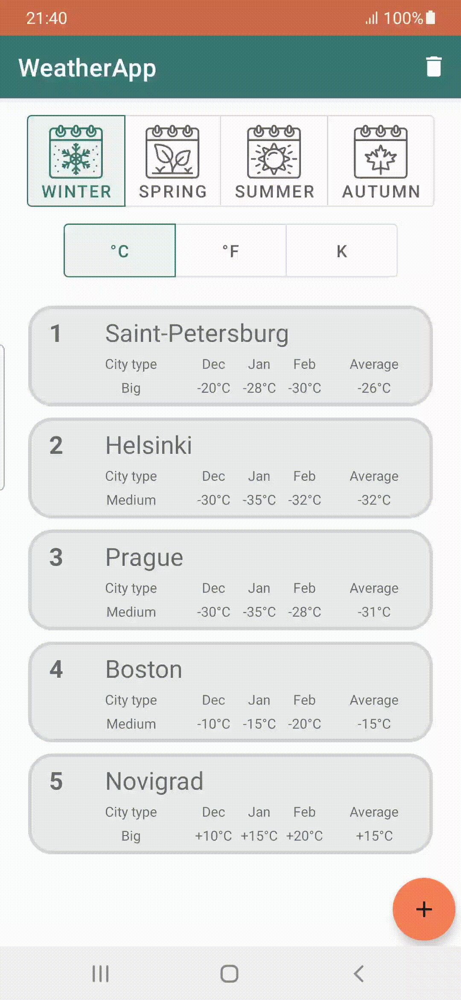
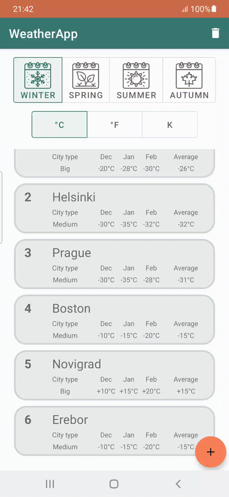

# WeatherApp
Application displays list of cities with temperature information for selected season.

## Technologies

- Recycler View, Fragments, Room, SQLite

## Features

- Add city: city name, city size, each month temperature 
- Update/delete city temperature data
- Season selection
- Temperature measurement scale selection

## Season and scale selection preview

## Add preview

## Update preview

## Delete preview

